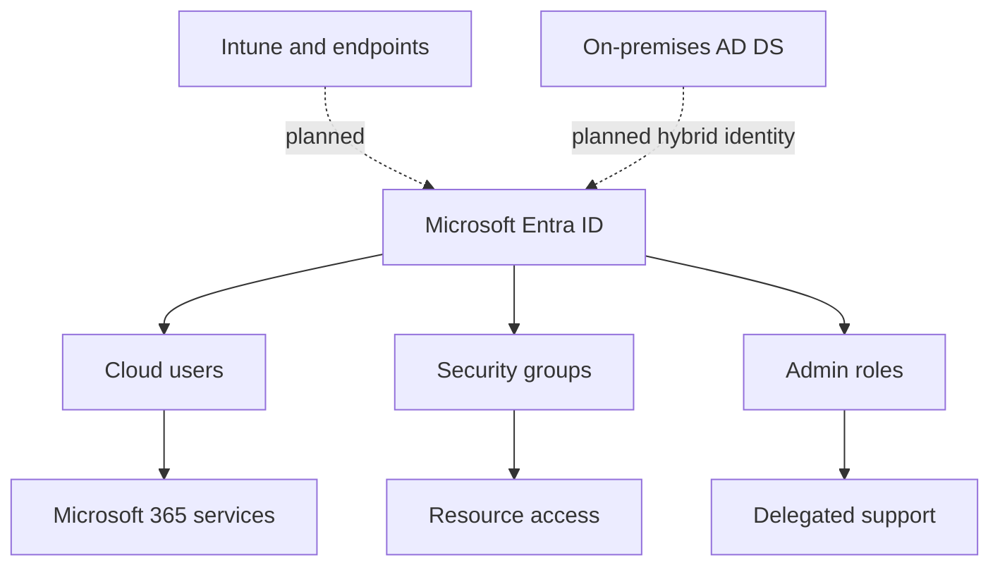

# Microsoft 365 Secure Hybrid Workplace Lab

A hands-on Microsoft 365 administration project that designs, implements, tests, and documents a secure cloud workplace for a simulated 25-user organisation.

> **Status:** In progress — identity foundation and delegated administration testing completed.

## Project objective

This project goes beyond basic portal configuration. Each control is linked to a business requirement, validated through positive and negative tests, and supported by sanitised evidence.

The lab currently covers:

- Microsoft Entra ID tenant baseline and security defaults
- Cloud-only identity onboarding
- Security-group-based access design
- Microsoft 365 Business Premium licensing
- Multifactor authentication registration
- Least-privilege administrative role delegation
- Password-reset support workflow
- Access-control testing and audit-evidence planning

Planned phases include Conditional Access, Intune, Microsoft Graph PowerShell automation, sign-in investigation, and hybrid identity integration with Windows Server Active Directory.

## Business scenario

**Northstar Fitness Group** is a fictional 25-user organisation adopting Microsoft 365 Business Premium. It needs secure employee onboarding, role-based access, auditable support operations, managed Windows endpoints, and a controlled path between on-premises Active Directory and Microsoft Entra ID.

This is a personal lab project. It does not represent production work performed for a real client.

## Current architecture

## Implemented controls

| Control | Implementation | Validation |
|---|---|---|
| Administrative account protection | MFA registered for the initial Global Administrator | Authenticator registration completed |
| Baseline tenant protection | Security Defaults enabled | Configuration reviewed without modification |
| Cloud employee onboarding | HR Coordinator account created as a cloud-only member | User type and sync state verified |
| Group-based access | `SG-HR-Employees` security group created | HR employee membership verified |
| Service entitlement | Business Premium licence assigned to HR user | Microsoft 365 sign-in completed |
| First-sign-in protection | Temporary password change and MFA registration completed | User onboarding tested |
| Standard-user restriction | HR user attempted to open Microsoft 365 Admin Center | Access denied — `AC-001 PASS` |
| Delegated support | Helpdesk Administrator role assigned to an IT support identity | Exactly one admin role verified |
| Password reset | Helpdesk identity reset a standard user's password | Operation completed — `HD-001 PASS`; audit evidence pending |

## Documentation

- [Project scenario and requirements](docs/01-project-scenario.md)
- [Tenant baseline](docs/02-tenant-baseline.md)
- [Identity and RBAC implementation](docs/03-identity-and-rbac.md)
- [Test register](docs/04-test-register.md)
- [Roadmap](docs/05-roadmap.md)
- [Evidence-handling rules](evidence/README.md)

## Security and privacy

No passwords, temporary credentials, MFA QR codes, tenant IDs, object IDs, billing details, private IP addresses, correlation IDs, or real employee data are stored in this repository. All users and business details used in demonstrations are fictional.

## Skills demonstrated

Microsoft Entra ID · Microsoft 365 Admin Center · Identity lifecycle · RBAC · Least privilege · MFA · Security groups · Licensing · Access-control testing · Troubleshooting · Technical documentation
